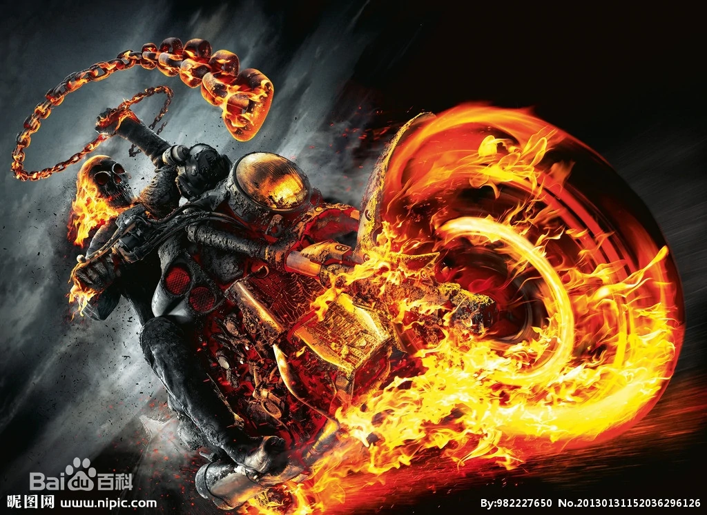

### 元祭项目

# `创 业 策 划 案`

##     

### 招标人：阿西和他的朋友们

#### 日  期：2202年 10月02日  

## 公司简介

### 我们的优势

#### 由Nonebot知名群友组成，个个上知天文下知地理，国际形势，石油期货，汉唐历史，世界名著，电子产品，高端生活，奢侈品牌，约炮技巧，把妹心得，床上功夫,揣摩人心....无不信手拈来，不到三十岁就积累了四十多年开发经验

1. 核心优势：RCNB

#### 我们由伟大的onebot协议发起人。Cqhttp nonebot作者RC领导。天无二日，我们心中只有RC一个太阳

2. 核心优势：群友个个都是人才

#### 专业团队，个个都是人才。一分钟不到就99+还不带重样的，我超喜欢这里的

3. 核心优势：先进的技术

#### 基于区块链和人工智能技术的元祭项目，对于落后的同类产品是降维打击

4. 核心优势：市场蓝海

#### 元公墓产业现在还是一片具有千亿产值潜力蓝海，却没有人来挖掘，现在 我们来了

## 项目背景

### 元祭项目扎根于元宇宙，迎合现在老龄化的趋势，打造符合新时代审美的新式公墓。既然有元宇宙公寓，元宇宙社区，为什么不能有元宇宙公墓呢
### 响应国家 “绿水青山就是金山银山” 的发展理念，2021年10月12日，总书记在《生物多样性公约》第十五次缔约方大会领导人峰会视频讲话中提出：“绿水青山就是金山银山。良好生态环境既是自然财富，也是经济财富，关系经济社会发展潜力和后劲。我们要加快形成绿色发展方式，促进经济发展和环境保护双赢，构建经济与环境协同共进的地球家园”。元公墓在祭拜逝者时，由于减少了实体供香和实体蜡烛的使用，所以降低了大量的碳排放，从而在一定程度上保护了环境，微小地缓解了全球变暖的问题；更有数据表明，每年清明节扫墓时，常会引起山火,导致生态被破坏，动物流离失所，为防止有人牢底坐穿和保护生态，元公墓更是从根本上解决了问题。
1. 基于区块链NFT 保证客户的资料永久储存
在调查了线上公墓失败的案例后，我们发现客户对这种新式公墓的不信任主要来自于对数字资源可靠性的怀疑，
我们对每一位墓主颁发独一无二的数字凭证，并基于区块链技术永久保存。让您的坟头不用担心被人刨掉。即使公司倒闭，您的数据也会永久的保存在链上。
2. 人格重建
基于人工智能技术，利用逝者生前的只言片语，即可重建一个完整的人格。客户可以像之前一样与先人进行对话。
我们提取了几十万的样本，进行了数千小时数的训练，将人格分为了65536个维度，远超现有心理学MBTI，大五等体系，基于这65536个维度分配权重，让重建出的人格独一无二。

3. 墓园森友会
让先人的数字灵魂真正的生活在这里，给先人提供高质量的居住条件，给后人提供完美的凭吊与互动场所。同时提供增值服务（房屋，家居，服装等）
4. 线上线下打通
与实体墓园合作，元祭绝不是为了取代实体墓园的存在，相反，我们是实体墓园的补充与升级，我们将于公墓合作，通过在墓碑刻制二维码的形式，实现线上线下互通，即拉到了墓园经济也可以推广元祭，形成双赢。
线下合作刻制二维码的推广行为我们称之为Winwin赢码。
5. AR招魂
配套产品“通灵宝镜”AR眼镜，戴上就可以看到先人的身影，基于人格重建可以还原出生前的一举一动。
还支持与他人的互动，通过模拟投掷灵魂匣的方式召唤灵魂进行对战，胜利者可以获得代币和称号。
另有召唤铃款 死灵书款 通灵板款。
另外，相信温子仁导演更是可以借助元公墓来完成《招魂4》
6. 墓园工会
不求同年同日生，但愿同年同日死。生前的兄弟，死后也应在一起。3名以上用户可以建立工会，第二碑半价。享受更优惠的服务。

## 盈利点

元祭的盈利点包括两部分，年费与增值服务：
1、 年费：墓地维护费，包括持续的墓地清洁工作和一定数量的黄纸、纸钱等凭吊物品。
2、 增值业务：付费高级的凭吊物品，PVP业务,排行榜

1. 年费
通过年费来固化客源，每逢节假日进行短信，微信公众号等全方位提醒，“您已经100天没有来看看长辈了”来提高客户活跃度。
2. 增值献祭业务
通过献祭方式消耗的服装，家具，甚至房屋院子，都会真正的送给先人，墓地也是给人住的，也要打扮的美美哒。
付费的高级纸钱，花圈，服装，道具。
通过付费获取扭蛋币，进行抽奖。获取稀有装饰道具，

限量版SSR 恶灵骑士摩托

3. PVP业务 提供香槟等付费道具可以在其他人的墓地使用。
您的仇家死了多是一件美逝啊，在仇人的葬礼上开一瓶香槟，再配上今天是个好日子的BGM来一场蹦迪岂不美哉。
坟头蹦迪套餐限时只要998  赠送黑桃A香槟一瓶。开封时自动播放音效，“好似 开香槟喽”。
同时支持好友间的和平PVP，通过灵魂匣召唤先人，进行象棋，广场舞，太极拳，极限攀岩等适合老人的运动。

4. 排行榜
没有什么比排行榜更能提高付费欲望了。
通过宜居度和战力排名，可以极大的提高人们的氪金欲望，增强客户的活跃度。

## 客户分析

### 通过对客户的小范围调研。对元祭产品接受度较高的多为25-35岁的年轻群体且购买力较高

## 客户留存

### 待补充

## 客户裂变

### 待补充

## 融资金额

### 10个亿
